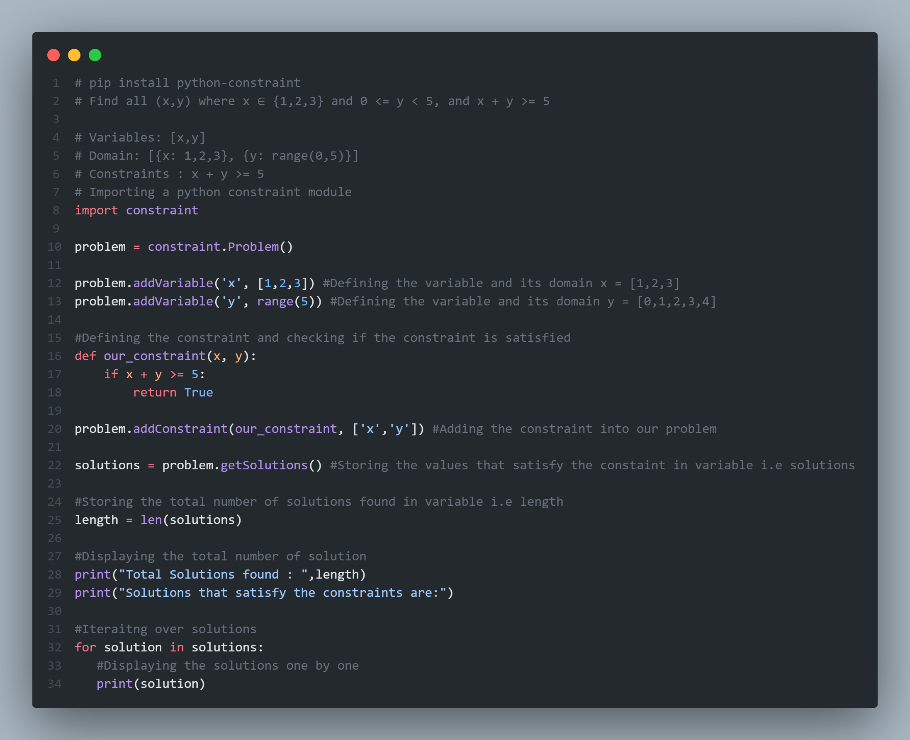
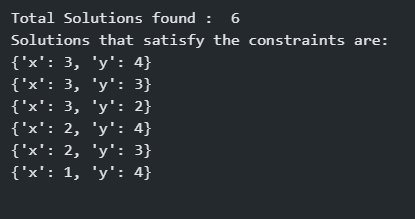
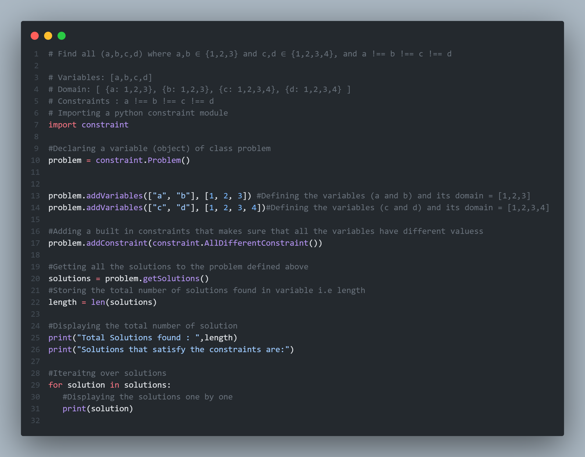
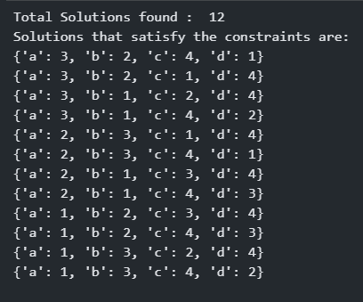
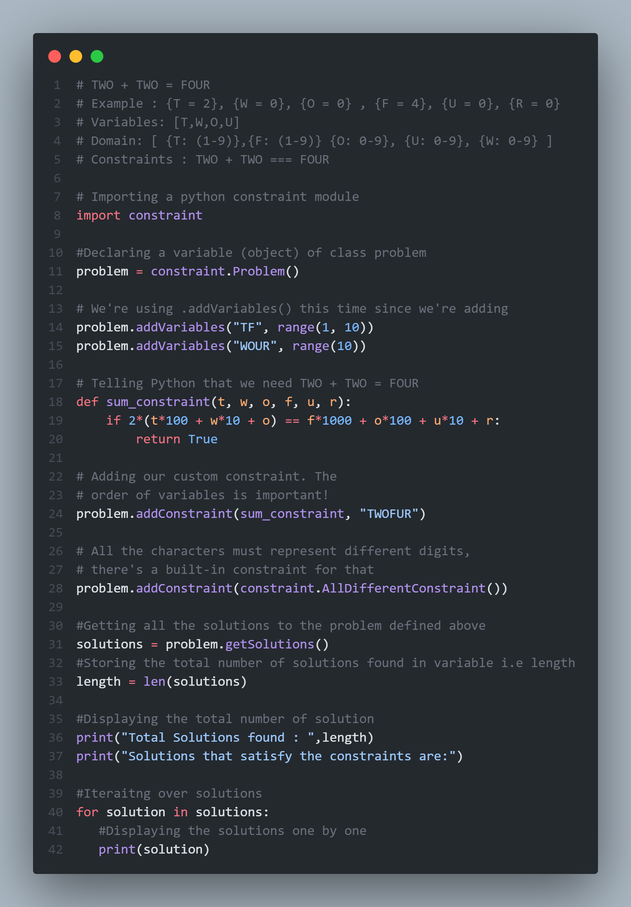
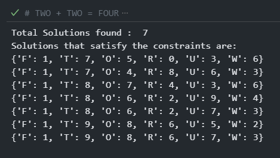
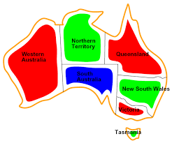
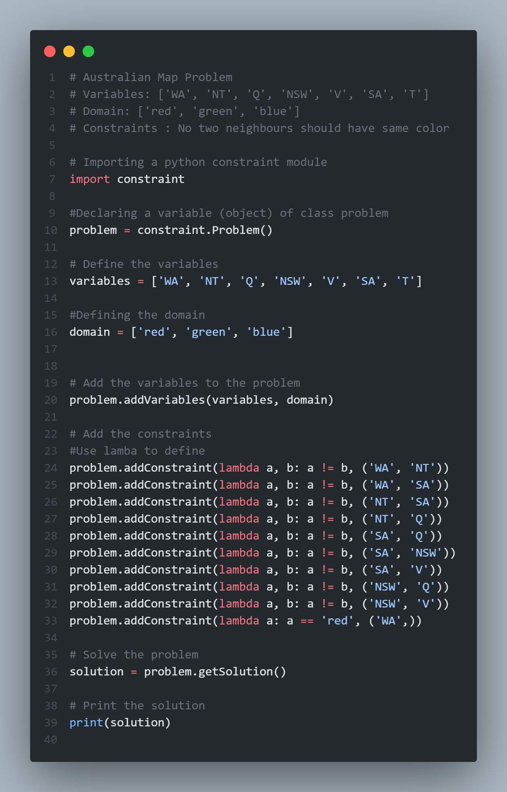
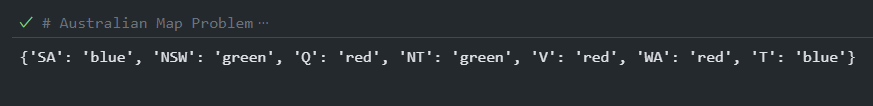

# CODE 1 - Find all (x,y) where x ∈ {1,2,3} and 0 <= y < 5, and x + y >= 5

## Code

## Output

# CODE 2 - Find all (a,b,c,d) where a,b ∈ {1,2,3} and c,d ∈ {1,2,3,4}, and a !== b !== c !== d

## Code

## Output

# CODE 3 - TWO + TWO = FOUR

## Code

## Output

# CODE 4 - Australian Map Problem

## Map

## Code

## Output

