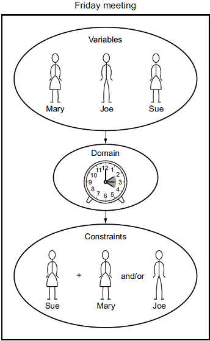

# What is CSP?

### A constraint satisfaction problem (CSP) consists of. a set of variables, a domain for each variable, and. a set of constraints.

### In artificial intelligence and operations research, constraint satisfaction is the process of finding a solution through a set of constraints that impose conditions that the variables must satisfy.

## Example of CSP

## The variables in the above example are Mary Joe and Sue.

## The domain is the availability from 2 to 4 PM

## The constraints are that either Sue and Mary need to attend or Joe needs to attend or They all can attend the meeting

## Solution: We have to find a time between 2 to 4 PM when either sue and mary both are available or a time when Joe is available

#

# Codes

# CODE 1 - Find all (x,y) where x ∈ {1,2,3} and 0 <= y < 5, and x + y >= 5

## Code

## Output

# CODE 2 - Find all (a,b,c,d) where a,b ∈ {1,2,3} and c,d ∈ {1,2,3,4}, and a !== b !== c !== d

## Code

## Output

# CODE 3 - TWO + TWO = FOUR

## Code

## Output

# CODE 4 - Australian Map Problem

## Map

## Code

## Output

